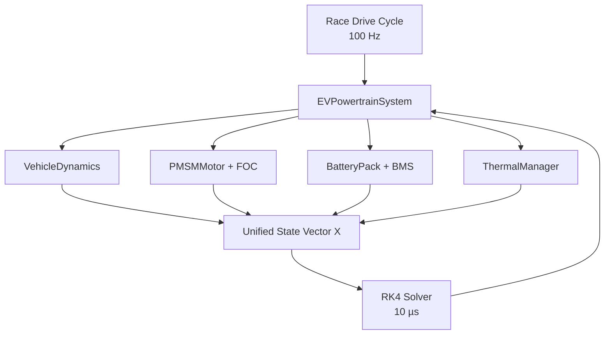

<div align="center">

# Advanced EV Powertrain & BMS Co-Simulation

**A modular, object-oriented MATLAB framework for simulating a high-performance electric race car from driver demand to battery thermal response.**

[](https://www.mathworks.com/products/matlab.html)


[](LICENSE)

Pure MATLAB · No Simulink · No Simscape · No additional toolbox

</div>

---

## Overview

This project models a FormulaStudent-type electric race car as one coupled electro-mechanical-thermal system. Vehicle dynamics, PMSM field-oriented control, inverter losses, a nonlinear 2-RC battery model, cell balancing, and liquid cooling are evaluated through a single fixed-step fourth-order Runge–Kutta solver.

The default configuration represents an **80 kWh, 400 V-class, 96s10p battery pack**. Its 960 physical cells are modeled as 96 independently monitored parallel groups, allowing the BMS to track group-level SoC, terminal voltage, temperature, and balancing activity.

## Key Features

- Object-oriented and dependency-injected system architecture
- One unified **393-state vector** for all continuous dynamics
- Custom fixed-step **RK4 integration at 10 µs**
- 600-second, 100 Hz high-dynamic race drive cycle
- PMSM model with matrix-based Clarke and Park transformations
- Cascaded speed and d/q current PI control
- Field weakening above base speed
- Motor copper, iron, windage, and inverter switching/conduction losses
- 96-group nonlinear 2-RC Thevenin battery model
- SoC- and temperature-dependent parameter lookup tables
- Passive, active, and hybrid balancing strategies
- BMS voltage scan and balancing update every 100 ms
- Battery, motor, coolant, pump, and radiator thermal dynamics
- Vectorized cell calculations with no explicit cell-level loops
- Automated speed, operating-map, battery, balancing, and thermal plots

## System Architecture



All physical components inherit from `DynamicComponent`. They are constructed in `buildEVSystem.m` and injected into `EVPowertrainSystem`, which owns the unified state layout and coordinates data exchange at every RK4 stage.

## Quick Start

### 1. Open the project

Extract the repository and open MATLAB in the project root:

```matlab
cd('path/to/EV_BMS_CoSimulation')
setupProjectPath
```

### 2. Run the smoke test

```matlab
report = run_smoke_tests();
```

Expected terminal message:

```text
All EV/BMS smoke tests passed (393 states, 2000 RK4 steps).
```

### 3. Run a simulation

Start with the lightweight smoke preset:

```matlab
simulationPreset = "smoke";
run("main_simulation.m");
```

Use one of the following presets:

| Preset | Simulated time | RK4 steps | Purpose |
|:--|--:|--:|:--|
| `smoke` | 0.20 s | 20,000 | Installation and architecture check |
| `short` | 10 s | 1,000,000 | Engineering preview |
| `full` | 600 s | 60,000,000 | Complete race-cycle simulation |

> [!IMPORTANT]
> The `full` preset performs four model evaluations per RK4 step, resulting in 240 million coupled derivative evaluations. Runtime depends strongly on the CPU. The electrical integration step remains 10 µs in every preset, while results are logged at 100 Hz to control memory usage.

## Model Components

| Component | Responsibility |
|:--|:--|
| `VehicleDynamics` | Longitudinal motion, aerodynamic drag, rolling resistance, road gradient, gearbox, and reflected rotational inertia |
| `PMSMMotor` | PMSM d/q dynamics, speed PI, current PI, Clarke–Park transforms, field weakening, torque production, and drive losses |
| `BatteryPack` | 96s10p pack, nonlinear 2-RC Thevenin dynamics, SoC integration, terminal constraints, and balancing logic |
| `ThermalManager` | Cell and motor heat generation, coolant flow, thermal resistance, pump control, and radiator rejection |
| `EVPowertrainSystem` | Dependency-injected component coupling, state packing, BMS scheduling, and physical state projection |
| `rk4Step` | Classical fourth-order integration of the complete coupled state vector |

## Unified State Vector

The default model uses `X ∈ R^393`:

| MATLAB indices | State | Dimension |
|:--|:--|--:|
| `1` | Vehicle longitudinal speed | 1 |
| `2:7` | PMSM currents, PI integrators, and electrical angle | 6 |
| `8:103` | Battery RC-1 polarization voltages | 96 |
| `104:199` | Battery RC-2 polarization voltages | 96 |
| `200:295` | Parallel-group SoC values | 96 |
| `296:391` | Parallel-group temperatures | 96 |
| `392` | Motor temperature | 1 |
| `393` | Coolant temperature | 1 |

Balancing masks and active-transfer commands are discrete BMS outputs. They are updated every 100 ms and held constant between BMS ticks; continuous states remain inside the single RK4-integrated vector.

## Battery and BMS

| Property | Value |
|:--|:--|
| Topology | 96s10p |
| Physical cell count | 960 |
| Nominal energy | 80 kWh |
| Voltage class | 400 V |
| Maximum pack voltage | 403.2 V |
| Equivalent model | Second-order Thevenin, 2-RC |
| Parameter dependencies | SoC and cell temperature |
| BMS update interval | 100 ms |
| Default balancing | Passive, 18 Ω bleeding resistance |

The following parameters are interpolated from nonlinear SoC–temperature surfaces during simulation:

```text
Voc, R0, R1, C1, R2, C2
```

Balancing mode can be changed in the configuration:

```matlab
cfg = defaultEVConfig("short");

cfg.bms.mode = 'passive';  % resistor bleeding
cfg.bms.mode = 'active';   % energy transfer
cfg.bms.mode = 'hybrid';   % both strategies
```

## Simulation Outputs

`plotSimulationResults` automatically generates:

1. Target versus actual vehicle speed and acceleration
2. Motor operating points on the torque-speed envelope
3. Field-weakening operating points and d/q current tracking
4. Pack SoC and minimum/maximum group SoC
5. Multi-line voltage plot for all 96 battery groups
6. Cell, motor, coolant, and ambient temperatures
7. Coolant mass-flow command and passive-balancing activity

To save result data and figures:

```matlab
cfg = defaultEVConfig("short");
cfg.output.saveResults = true;
cfg.output.saveFigures = true;

results = runEVSimulation(cfg);
plotSimulationResults(results, cfg);
```

Generated files are written to the `output/` directory.

## Simulation KPI Summary

Every run produces a compact post-simulation report in the MATLAB Command
Window. It includes distance, energy drawn, regenerative energy, net
consumption, speed-tracking error, peak battery currents, voltage limits,
thermal peaks, balancing performance, and field-weakening duration.

```text
===== EV SIMULATION KPI SUMMARY =====
Simulated time                          10.000 s
Distance travelled                      0.180 km
Energy drawn                            0.4200 kWh
Regenerative energy                     0.0600 kWh
Net energy                              0.3600 kWh
Net consumption                       2000.0 Wh/km
Maximum vehicle speed                  55.80 km/h
Peak discharge current                 428.0 A
Minimum pack voltage                   382.0 V
Final cell-voltage spread                8.40 mV
=====================================
```

The metrics are also available programmatically:

```matlab
summary = summarizeSimulationResults(results);
```

When `cfg.output.saveResults` is enabled, the summary is saved as
`output/simulation_summary.csv` and embedded in `results.summary`.

## Project Structure

```text
EV_BMS_CoSimulation/
├── main_simulation.m
├── setupProjectPath.m
├── components/
│   ├── @DynamicComponent/
│   ├── @VehicleDynamics/
│   ├── @PMSMMotor/
│   ├── @BatteryPack/
│   └── @ThermalManager/
├── system/
│   └── @EVPowertrainSystem/
├── simulation/
│   ├── runEVSimulation.m
│   ├── initializeSimulationLog.m
│   ├── recordSimulationLog.m
│   └── trimSimulationLog.m
├── solvers/
│   └── rk4Step.m
├── functions/
│   ├── defaultEVConfig.m
│   ├── validateEVConfig.m
│   ├── buildEVSystem.m
│   ├── generateRaceDriveCycle.m
│   ├── sampleDriveCycle.m
│   ├── summarizeSimulationResults.m
│   └── plotSimulationResults.m
├── tests/
│   └── run_smoke_tests.m
├── VALIDATION.md
└── LICENSE
```

The only explicit `for` loop in the project is the outer RK4 time loop in `runEVSimulation.m`. Battery-group and thermal calculations are vectorized.

<details>
<summary><strong>Core Equations</strong></summary>

### Vehicle dynamics

$$
\dot{v}=\frac{F_{traction}-F_{drag}-F_{rolling}-F_{grade}}{m_{eq}}.
$$

Rotating wheel and motor inertias are reflected into the equivalent vehicle mass.

### PMSM dynamics

$$
\dot{i}_d=\frac{v_d-R_si_d+\omega_eL_qi_q}{L_d},
\qquad
\dot{i}_q=\frac{v_q-R_si_q-\omega_e(L_di_d+\psi_f)}{L_q}.
$$

$$
T_e=\frac{3}{2}p\left[\psi_fi_q+(L_d-L_q)i_di_q\right].
$$

### Battery dynamics

$$
\dot{V}_1=\frac{I_g}{C_1}-\frac{V_1}{R_1C_1},
\qquad
\dot{V}_2=\frac{I_g}{C_2}-\frac{V_2}{R_2C_2}.
$$

$$
V_t=V_{oc}(SoC,T)-V_1-V_2-I_gR_0,
\qquad
\dot{SoC}=-\frac{I_{eff}}{3600Q_g}.
$$

The battery current is obtained from the closed-form power balance:

$$
P=(E-IR)I
\quad\Rightarrow\quad
I=\frac{2P}{E+\sqrt{E^2-4RP}}.
$$

### Thermal dynamics

Cell, motor, and coolant temperatures are updated using lumped thermal capacitances, flow-dependent thermal resistances, and Newton cooling. Battery ohmic/polarization losses and balancing-resistor heat are passed directly into the thermal model.

</details>

## Validation

The included smoke test checks:

- Clarke–Park forward/reverse transformation consistency
- Positive Thevenin LUT parameters
- OCV interpolation bounds
- Unified state and derivative dimensions
- Finite final state values
- Pack and battery-group voltage limits
- Drive-cycle endpoint interpolation

Run it with:

```matlab
report = run_smoke_tests();
```

Additional design-time verification results are documented in [`VALIDATION.md`](VALIDATION.md).

## Scope and Limitations

This is a control-oriented research and engineering model. Default LUT values and loss coefficients provide a physically consistent starting point, but they should be calibrated against the target cell, motor, inverter, cooling plate, and test-bench data before design decisions are made.

The inverter model calculates average switching and conduction losses; individual semiconductor switching events are not resolved. Tire slip, lateral dynamics, yaw, suspension, differential behavior, and CFD-level coolant flow are outside the current scope.

## License

Released under the [MIT License](LICENSE).

## Author

Ahmet Yusuf Hitay @YasayanEfsane
---

<div align="center">


</div>
