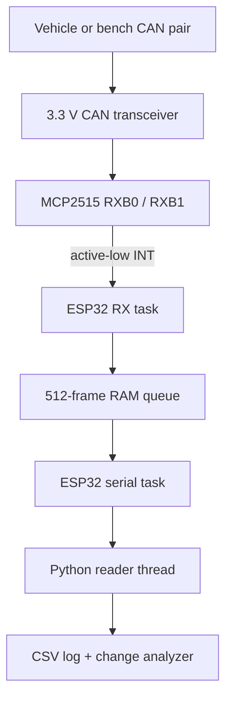

# Advanced CAN Analyzer


An interrupt-driven, receive-only CAN 2.0B capture probe and desktop
reverse-engineering toolkit for studying undocumented automotive networks. The
reference target is a classic ESP32 connected to an MCP2515 and a 3.3 V CAN
transceiver. The desktop tool logs every accepted frame, highlights byte-level
changes, and supports live dictionary-backed filtering.

The project is suitable for older vehicles and bench networks where the actual
bitrate, controller oscillator, physical layer, and diagnostic connector wiring
have first been verified. It includes 250 kbit/s and 500 kbit/s firmware targets.

> [!WARNING]
> Never connect an experimental interface while a vehicle is moving. Work on a
> bench harness or a stationary vehicle with the drivetrain disabled. Incorrect
> wiring, termination, power conversion, or active transmission can disturb
> safety-critical ECUs. This firmware intentionally has no transmit API and
> requests MCP2515 Listen-Only mode.

> [!IMPORTANT]
> MCP2515 is a stand-alone CAN **controller**, not a CAN physical-layer
> transceiver. A compatible transceiver such as SN65HVD230 is still required.
> Many inexpensive MCP2515/TJA1050 modules expose 5 V logic and must not be wired
> directly to an ESP32. Verify the exact module schematic and crystal frequency.

## 1. Quick Start

### 1.1 Confirm the vehicle interface

1. Obtain the correct electrical diagram or service information for the exact
   vehicle, model year, engine, market, and diagnostic connector.
2. Confirm that the target pair is high-speed CAN, not K-line, J1850, or a
   manufacturer-specific non-CAN link.
3. With power removed and the network asleep, validate the differential pair and
   existing termination using appropriate test equipment.
4. Start on a bench CAN network whenever possible.

A 2002 Kia Sorento must not be assumed to expose ISO 15765 CAN on the usual OBD
pins merely because it has a 16-pin connector. If pins 6 and 14 are absent, the
electrical diagram identifies another protocol, or neither bitrate produces
valid frames, stop and verify the physical layer before changing software.

### 1.2 Build and upload the firmware

Install [Visual Studio Code](https://code.visualstudio.com/) and the
[PlatformIO extension](https://platformio.org/install/ide?install=vscode), then
open this repository as the project directory.

```bash
# Default: 500 kbit/s CAN, 8 MHz MCP2515 crystal, 921600 baud serial
pio run -e esp32dev-500k-8mhz
pio run -e esp32dev-500k-8mhz -t upload
```

For a verified 250 kbit/s bus:

```bash
pio run -e esp32dev-250k-8mhz
pio run -e esp32dev-250k-8mhz -t upload
```

### 1.3 Start the analyzer

Linux/macOS:

```bash
python3 -m venv .venv
source .venv/bin/activate
python -m pip install -r analyzer/requirements.txt
python analyzer/can_analyzer.py \
  --port /dev/ttyUSB0 \
  --baud 921600 \
  --config analyzer/filter_config.json \
  --log captures/idle.csv
```

Windows PowerShell:

```powershell
py -m venv .venv
.\.venv\Scripts\Activate.ps1
py -m pip install -r analyzer\requirements.txt
py analyzer\can_analyzer.py `
  --port COM5 `
  --baud 921600 `
  --config analyzer\filter_config.json `
  --log captures\idle.csv
```

List serial ports when the device name is unknown:

```bash
python -m serial.tools.list_ports -v
```

## 2. Requirements

| Area | Requirement | Notes |
| --- | --- | --- |
| MCU | Classic ESP32 development board | Pin defaults target ESP32-WROOM/`esp32dev` |
| CAN controller | MCP2515 | 8 MHz default; 16 MHz is supported by the timing table |
| CAN transceiver | SN65HVD230 or equivalent 3.3 V device | MCP2515 alone cannot drive CANH/CANL |
| Host connection | Data-capable USB cable | 921600 baud by default |
| Firmware toolchain | PlatformIO + Arduino framework | No third-party CAN library is required |
| Desktop runtime | Python 3.10 or newer | `pyserial` is the only runtime dependency |
| Test equipment | Multimeter and preferably oscilloscope/CAN analyzer | Verify power, pair, bitrate, and waveform |
| Vehicle documentation | Exact service wiring information | Required for older/proprietary networks |

## 3. Architecture



The critical separation is between capture and presentation. The GPIO ISR only
sends a FreeRTOS task notification. The high-priority RX task then performs SPI
transactions, drains both MCP2515 receive buffers, and places fixed-size records
in RAM. String formatting and UART output run in another task on the other core.

## 4. Hardware Connections

### 4.1 ESP32 to MCP2515 SPI

The firmware uses ESP32 VSPI with non-strapping pins for chip select and
interrupt:

| ESP32 | Direction | MCP2515/module label | Purpose |
| --- | --- | --- | --- |
| 3V3 | Power | VCC | 3.3 V controller/module supply only when supported |
| GND | Power | GND | Logic reference |
| GPIO 18 | Output | SCK | SPI clock, mode 0 |
| GPIO 23 | Output | SI / MOSI | ESP32 to MCP2515 data |
| GPIO 19 | Input | SO / MISO | MCP2515 to ESP32 data |
| GPIO 27 | Output | CS / nCS | Active-low SPI chip select |
| GPIO 26 | Input | INT / nINT | Active-low receive interrupt |

In words: connect GPIO 18 to SCK, GPIO 23 to SI/MOSI, GPIO 19 to SO/MISO,
GPIO 27 to CS, and GPIO 26 to INT. Join the logic grounds. The firmware enables
the ESP32 input pull-up on INT; a local external pull-up appropriate to the
controller voltage is still recommended on a custom PCB.

### 4.2 MCP2515 to the physical-layer transceiver

For a bare MCP2515 plus SN65HVD230 design:

| MCP2515 signal | SN65HVD230 signal | Function |
| --- | --- | --- |
| TXCAN | D | Controller transmit logic into the transceiver |
| RXCAN | R | Transceiver receive logic into the controller |
| VDD / VSS | 3V3 / GND | Shared 3.3 V logic supply and reference |
| — | CANH / CANL | Differential bus pair |
| — | RS | Tie low for high-speed mode, following the transceiver datasheet |

Place a 100 nF ceramic decoupling capacitor close to each IC supply pin. A
custom MCP2515 board also needs the correctly loaded 8 MHz or 16 MHz crystal,
RESET biasing, and layout consistent with the component datasheets.

### 4.3 CAN pair and diagnostic connector

On an ISO 15765 OBD-II connector, pins 6 and 14 are conventionally CAN-H and
CAN-L, while pins 4/5 are grounds. Treat that as a connector convention, not
proof that a particular 2002 vehicle implements CAN there. Use the exact vehicle
wiring diagram and a breakout lead; never probe by trial and error.

Do not power the ESP32 directly from OBD pin 16. A vehicle electrical system can
produce reverse polarity, cranking dips, and high-energy transients. For early
testing, power the ESP32 from USB. A permanent installation needs a fused,
reverse-polarity-protected, transient-rated automotive supply or isolation.

### 4.4 Termination

Do **not** enable the common module's 120-ohm termination resistor when tapping
an already terminated in-vehicle bus. Two endpoint resistors in parallel
normally appear near 60 ohms across CAN-H and CAN-L with the network unpowered.
Add termination only when constructing a bench bus and only at its two physical
ends.

Detailed electrical notes are in [docs/HARDWARE.md](docs/HARDWARE.md).

## 5. Firmware Configuration

The two ready-to-build targets are defined in `platformio.ini`:

| Environment | CAN bitrate | MCP2515 crystal | Serial bitrate |
| --- | ---: | ---: | ---: |
| `esp32dev-500k-8mhz` | 500 kbit/s | 8 MHz | 921600 baud |
| `esp32dev-250k-8mhz` | 250 kbit/s | 8 MHz | 921600 baud |

For a 16 MHz MCP2515 board, copy the appropriate environment and set:

```ini
-D MCP2515_OSCILLATOR_MHZ=16
```

The firmware accepts only the validated 8/16 MHz and 250/500 kbit/s
combinations. An unsupported setting fails at compile time or initialization.
The CNF register triplets live in `firmware/src/mcp2515.cpp`.

## 6. Build, Upload, and Monitor

Build without writing to the board:

```bash
pio run -e esp32dev-500k-8mhz
```

Upload and open a monitor:

```bash
pio run -e esp32dev-500k-8mhz -t upload
pio device monitor --baud 921600
```

Expected startup and health output:

```text
#BOOT:AdvancedCANAnalyzer:v1
#CFG:bitrate=500000,oscillator=8000000,serial=921600,mode=listen-only
#STAT:ready=1,rx=1832,queue_drop=0,hw_overflow=0,bad=0
```

Expected frame output:

```text
S123:8:00,10,20,30,40,50,60,70
S123:8:00,11,20,30,40,4F,60,70
E18DAF110:3:AA,BB,CC,00,00,00,00,00
```

## 7. Interrupt and Concurrency Contract

The implementation intentionally follows these rules:

1. `onCanInterrupt()` is marked `IRAM_ATTR`.
2. The ISR performs exactly one task notification and an optional scheduler
   yield. It performs no SPI, UART, heap allocation, formatting, or logging.
3. `receiveTask()` sleeps indefinitely until notified by MCP2515 INT.
4. After wake-up, it drains RXB0 and RXB1 until no actionable interrupt flag
   remains. This bounded drain is interrupt servicing, not periodic polling.
5. Frames enter a 512-element, fixed-size FreeRTOS queue with a zero wait time.
6. `serialTask()` formats one complete line and submits it with one
   `Serial.write()` call.
7. Arduino's default `loop()` task deletes itself; there is no `delay()` loop.
8. MCP2515 reset and mode-settle intervals use one-shot `esp_timer` events. The
   initialization task sleeps on notifications instead of busy-waiting.

The MCP2515 has only two hardware receive buffers. Interrupt servicing and the
RAM queue greatly improve burst tolerance, but cannot make an under-capacity
ASCII serial link lossless forever. Watch both `queue_drop` and `hw_overflow`.
For a consistently busy 500 kbit/s network, use a shorter binary protocol or a
higher serial rate such as 2 Mbaud after verifying the USB-UART bridge and host.

## 8. Serial Protocol Contract

Every data line has this grammar:

```text
TYPE + HEX_ID : DLC : D0,D1,D2,D3,D4,D5,D6,D7 \n
```

| Type | Identifier | Meaning |
| --- | --- | --- |
| `S` | Three hex digits | Standard 11-bit data frame |
| `E` | Eight hex digits | Extended 29-bit data frame |
| `R` | Three hex digits | Standard remote frame |
| `X` | Eight hex digits | Extended remote frame |

The eight byte fields are always present. Positions above DLC are zero-filled so
the host parser has fixed field count. Lines beginning with `#` are metadata or
diagnostics and are not CAN frames. Hexadecimal output is uppercase and contains
no spaces.

See [docs/SERIAL_PROTOCOL.md](docs/SERIAL_PROTOCOL.md) for the precise parser
rules and counters.

## 9. Desktop Analyzer

The analyzer uses a dedicated reader thread to drain the operating system's
serial buffer in large chunks. Parsed frames enter a bounded queue; the main
thread applies filters, writes CSV rows, and renders byte changes.

Change notation remains visible even when ANSI colors are disabled:

| Marker | Default color | Meaning |
| --- | --- | --- |
| `[*7F]` | Yellow | First displayed value/baseline |
| `[+80]` | Green | Value increased since the last displayed frame |
| `[-10]` | Red | Value decreased since the last displayed frame |
| ` 10 ` | Normal | Unchanged byte |
| ` -- ` | Dim | Byte position is above DLC |

Example:

```text
12:34:56.120 S123 DLC=8 [*00] [*10] [*20] [*30] [*40] [*50] [*60] [*70] changed=8
12:34:56.140 S123 DLC=8  00  [+11]  20   30   40  [-4F]  60   70  changed=2
```

Use `--no-color` for plain logs or set the conventional `NO_COLOR` environment
variable.

## 10. Dynamic Filtering

Filtering is dictionary-backed and affects console rendering only. The active
CSV capture continues to receive every valid frame.

| Command | Effect |
| --- | --- |
| `ignore 0x201` | Add ID `0x201` to the ignore dictionary |
| `allow 0x201` | Remove its ignore state |
| `throttle 0x201 10` | Display that ID at no more than 10 Hz |
| `unthrottle 0x201` | Remove its rate cap |
| `auto-ignore 200` | Auto-hide IDs measured above 200 frames/s |
| `auto-ignore off` | Disable new automatic ignore rules |
| `clear-auto` | Remove automatically created rules |
| `changes-only on` | Hide frames unchanged since their last display |
| `list` | Print the current rule dictionary |
| `stats` | Print reader, malformed, queue-drop, and device counters |
| `quit` | Flush the CSV capture and exit |

Persistent defaults are stored in `analyzer/filter_config.json`:

```json
{
  "ignore_ids": ["0x201", "0x7DF"],
  "rate_limits_hz": {
    "0x100": 10,
    "0x316": 20
  },
  "auto_ignore_above_hz": null,
  "changes_only": false
}
```

Command-line filters may be repeated:

```bash
python analyzer/can_analyzer.py \
  --port /dev/ttyUSB0 \
  --ignore 0x201 \
  --ignore 0x202 \
  --changes-only \
  --log captures/pedal_sweep.csv
```

## 11. CSV Capture Contract

The CSV file contains:

| Column | Description |
| --- | --- |
| `time_utc` | Host wall-clock receipt time in UTC |
| `timestamp_ns` | Host Unix timestamp in nanoseconds |
| `frame_type` | `S`, `E`, `R`, or `X` |
| `can_id_hex` | CAN identifier prefixed with `0x` |
| `dlc` | Data length code, 0 through 8 |
| `d0` ... `d7` | Fixed-width uppercase hexadecimal bytes |
| `raw_line` | Original validated firmware line |

CSV output is buffered and flushed every 250 frames, then flushed again on a
clean exit or Ctrl+C. The timestamps are assigned by the host after serial
transport; they are not bus-accurate hardware timestamps.

## 12. Reverse-Engineering Workflow

1. Capture a stationary baseline with ignition state documented.
2. Record one controlled action at a time: pedal sweep, switch press, lamp,
   steering input on a safe bench/simulator, or another non-driving stimulus.
3. Add known noisy IDs to `ignore_ids` or apply per-ID throttles.
4. Enable `changes-only on` and repeat the single action several times.
5. Look for repeatable byte positions, direction, endianness, counters, and
   checksums rather than trusting a single correlation.
6. Compare idle/action captures externally and formulate a scaling hypothesis.
7. Validate the hypothesis across the full operating range without transmitting
   onto the vehicle network.

Common interpretations to test include unsigned/signed integers, little- and
big-endian words, bit fields, rolling counters, multiplexors, and affine
scaling:

\[
y = a \cdot \operatorname{raw} + b
\]

Correlation does not establish meaning. A changing byte may be a counter,
checksum, multiplexor, or another signal sharing the same frame.

## 13. Offline Mutation Tool

`offline_mutator.py` generates candidate payloads from a recorded seed frame for
unit-testing decoders and dashboards. It never opens a serial port and cannot
transmit onto CAN.

Create eight single-bit mutations of byte 2 from the last captured `0x316`
frame:

```bash
python analyzer/offline_mutator.py captures/pedal_sweep.csv \
  --id 0x316 \
  --byte 2 \
  --strategy bitflip \
  --output captures/offline_candidates.csv
```

Create boundary-value candidates instead:

```bash
python analyzer/offline_mutator.py captures/pedal_sweep.csv \
  --id 0x316 \
  --byte 2 \
  --strategy boundary \
  --output captures/boundary_candidates.csv
```

> [!WARNING]
> Do not convert offline candidates into live vehicle transmissions. Active CAN
> fuzzing belongs on an isolated, current-limited bench with sacrificial ECUs,
> explicit authorization, and an independent method to stop traffic.

## 14. Replay Without Hardware

Validate highlighting and filter behavior using the included fixture:

```bash
python analyzer/can_analyzer.py \
  --replay tests/fixtures/serial_frames.log \
  --replay-interval-ms 100 \
  --no-input
```

This is also useful for terminal screenshots and parser development.

## 15. Project Structure

```text
AdvancedCANAnalyzer/
├── README.md
├── platformio.ini
├── analyzer/
│   ├── can_analyzer.py
│   ├── filter_config.json
│   ├── offline_mutator.py
│   └── requirements.txt
├── docs/
│   ├── HARDWARE.md
│   └── SERIAL_PROTOCOL.md
├── firmware/
│   ├── include/
│   │   ├── config.hpp
│   │   └── mcp2515.hpp
│   └── src/
│       ├── main.cpp
│       └── mcp2515.cpp
└── tests/
    ├── fixtures/serial_frames.log
    ├── test_analyzer.py
    └── test_offline_mutator.py
```

## 16. Source Components

| File | Responsibility |
| --- | --- |
| `config.hpp` | Pins, queue sizing, serial rate, CAN bitrate, oscillator selection |
| `mcp2515.hpp/.cpp` | Minimal receive-only SPI driver and validated bit timing |
| `main.cpp` | ISR, timer-driven initialization, RX task, queue, serial task |
| `can_analyzer.py` | Serial reader, parser, CSV logger, highlighting, live filters |
| `offline_mutator.py` | Receive-capture mutation for offline decoder tests |
| `filter_config.json` | Persistent ignore/rate/auto-ignore policy |
| `tests/` | Parser, highlighting, filter, and mutation regression tests |

## 17. Validation

Run the dependency-free unit suite:

```bash
python -m unittest discover -s tests -v
```

Expected result:

```text
Ran 7 tests

OK
```

Run Python bytecode compilation:

```bash
python -m compileall -q analyzer tests
```

Build both firmware configurations:

```bash
pio run -e esp32dev-500k-8mhz
pio run -e esp32dev-250k-8mhz
```

Before vehicle connection, validate with two known-good CAN nodes or a CAN
generator. Confirm `ready=1`, changing RX count, zero drop counters, correct ID
width, and expected payloads.

Because Listen-Only mode deliberately sends no ACK bit, a bench transmitter that
requires acknowledgment also needs another ACK-capable CAN node. The sniffer
must never be counted as that node.

## 18. Troubleshooting

### `#FATAL:mcp2515_initialization_failed`

- Check 3.3 V and ground at the controller.
- Verify CS, SCK, MOSI, and MISO continuity.
- Confirm that the crystal is 8 MHz or 16 MHz and matches the build target.
- Confirm that the MCP2515 reaches Listen-Only mode.
- Shorten jumper wires and inspect SPI mode-0 signals with a logic analyzer.

### `ready=1` but `rx=0`

- Verify that the target really is CAN and that other nodes are communicating.
- Try the separately built 250 kbit/s target only after verifying the wiring.
- Swap CAN-H/CAN-L only after confirming the pair with documentation; do not
  guess on a vehicle connector.
- Check that the transceiver is enabled and voltage-compatible.
- Revisit the possibility of K-line or another legacy protocol.

### `hw_overflow` increases

- Keep the RX task at higher priority than formatting/logging work.
- Check SPI wiring and reduce the SPI clock if signal integrity is poor.
- Reduce physical bus load and remove erroneous extra termination.
- MCP2515 has only two receive buffers; a modern controller with deeper queues
  may be required for a saturated network.

### `queue_drop` increases

- Increase the serial rate on firmware and host together.
- Avoid the Arduino serial monitor while Python owns the port.
- Reduce ASCII overhead only by changing both firmware and parser as one
  protocol version.
- Do not mistake console filtering for capture load reduction; filters are
  deliberately applied after logging.

### Python reports malformed lines

- Match `--baud` to `SERIAL_BAUD` exactly.
- Close other applications using the serial port.
- Use a short, data-capable USB cable.
- Confirm firmware lines follow `TYPE+ID:DLC:eight-bytes`.

### ESP32 resets or will not boot

- Do not feed 5 V into any ESP32 GPIO.
- Verify that the chosen module does not pull boot-strapping pins.
- Power the interface independently from a protected source.
- Inspect ground offset; use an isolated CAN interface when required.

## 19. Limitations

- CAN 2.0A/B only; MCP2515 does not support CAN FD.
- The default firmware implements 250 and 500 kbit/s only.
- Host timestamps include UART and operating-system latency.
- ASCII output can exceed 921600-baud capacity on a saturated 500 kbit/s bus.
- MCP2515 has two receive buffers and no deep hardware FIFO.
- No automatic bitrate detection is implemented.
- No DBC inference, checksum discovery, or semantic guarantee is provided.
- The live system is intentionally receive-only; no injection or diagnostic
  request channel exists.
- A generic OBD connector pinout does not identify a 2002 vehicle's actual
  protocol.

## 20. Hardening Checklist

Before converting the bench prototype into a durable telemetry device:

- [ ] Verify the exact vehicle network and connector from service information.
- [ ] Use an automotive-qualified transceiver and protected power supply.
- [ ] Add reverse-polarity, ESD, surge, and load-dump protection.
- [ ] Add galvanic isolation where ground potential cannot be controlled.
- [ ] Preserve listen-only mode and omit transmit routing in hardware if feasible.
- [ ] Use locking connectors, strain relief, enclosure, and conformal protection.
- [ ] Validate temperature, vibration, EMC, brownout, and watchdog behavior.
- [ ] Move to binary USB or native USB for sustained high bus utilization.
- [ ] Record firmware version, bitrate, oscillator, vehicle state, and test action
      with every capture.
- [ ] Keep all experiments off public roads and away from active safety systems.

## 21. Technical References

- [Microchip MCP2515 Family Data Sheet](https://ww1.microchip.com/downloads/aemDocuments/documents/APID/ProductDocuments/DataSheets/MCP2515-Family-Data-Sheet-DS20001801K.pdf)
- [Arduino MCP2515 reference implementation](https://github.com/autowp/arduino-mcp2515)
- [Espressif ESP32 GPIO documentation](https://docs.espressif.com/projects/esp-idf/en/stable/esp32/api-reference/peripherals/gpio.html)
- [Espressif ESP32 SPI master documentation](https://docs.espressif.com/projects/esp-idf/en/stable/esp32/api-reference/peripherals/spi_master.html)
- [pySerial API documentation](https://pyserial.readthedocs.io/en/latest/pyserial_api.html)
